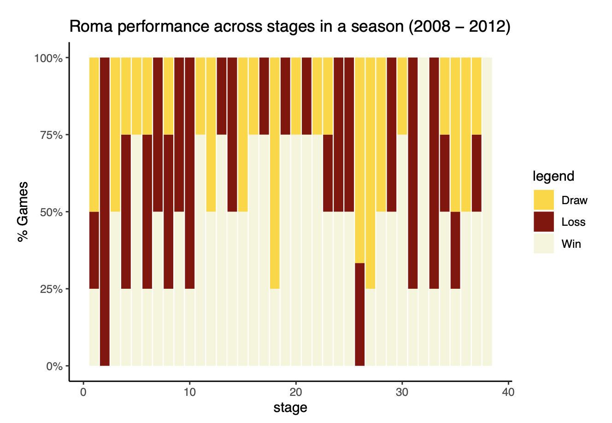

## Description of case

More industries and organizations are applying machine learning methods to optimize resources and maximise the efficiency of their businesses.  
Owing to this, the sporting organizations are increasingly relying on applications of Probabiliistic models and Bayesian methods to create and define rules for better performance.

In one such scenario, imagine you are incharge managing the soccer team for a leading club in Europe.
How can you find the best combination of players within your squad to maximise the probability of a positive result against a
stubborn opponent?

## Approach

Here, I make use of Association Rules based on the Apriori algorithm to figure out the strongest links in wins and losses that have occured in the past results. This is then used to make inferences about the common links and rules and reshape the squad strategies for the future. This specially helps when the team has a tight budget and thus are limited in the transfer market to pursue new (better) players. 

#### Dataset

The dataset sample can be obtained from Kaggle <https://www.kaggle.com/karangadiya/fifa19>. 
This included team, match and player level of details for every team in the European Soccer (Football) leagues.

#### Analysis 

For the analysis, AS Roma was picked as the parent club for which we are trying to find winning solutions.

The numerous steps were following:

* Exploratory analysis to visualize the performance of AS Roma in the Serie A for last 8 seasons
  * To identify the overall performance of Serie A leaders and followers and the competition shape, identify top opponents
* Using Team-Player attributes to find patters associated with Key Oppenent's 
  * Using Apriori Algorithm based association rules to identify the combination of players which have led to favorable results in the past 

###### Roma's performance and top opponents 

Roma has consistenly been a top-6 team in Serie A for many years now, occasionally finishing in top 2 as well. 2014 was a great year for the club where, the team won the Serie A, beating the opponents Juventus in a close 2 horse race. The figure below shows how Roma has performed over the 8 seasons in terms of match results. 

Following, I looked at the performance through the seasons (visualizing the different stages of a Serie A league season). Through this, it can be seen that a contrast in how the performance goes as the season progresses.

<b> 2008 - 2012 </b>

<b> 2012 - 2016 </b>

   
  
Further, I find out the the top opponents for Roma using through the below plot. They are Juventus, Sampdoria, Palermo, Genoa and Napoli.
  

  
<b> This will help in the further analysis, where I look at the loss patterns for Roma vs the opponents and find out the gaps that can be explored. </b>

<b> Association Rule Mining </b>

Below, I identify the rules leading to the losses for the 5 teams discovered above using apriori rules. 

    1. Roma Losses

 

    2. Juventus Losses

 

    3. Sampdoria Losses

 

    4. Palermo Losses

 

    5. Genoa Losses

 

    6. Napoli Losses

 

## Final Thoughts and Conclusions

<b>Juventus </b>

* If we set up a team with fast forwards and defenders who can have the vision to spot a forward's run, we can get the better of Juventus

* Another approach would be to have a mid-field with players can shoot and finish well. In this case, we don't need defenders with high vision
  
  
<b> Sampdoria </b>
* The best way to setup against Sampdoria is to include box to box mid-fielders with high stamina. These will help turn defense to attack in games. They can be set with forwards with high finishing and volleying skills to make the most of the attacking move
  
  
<b> Palermo </b>
* Midfield is the key to beating Palermo. Mid-fielders with high ball playing skills increase the chances of winning against Palermo. In addition, on occasions, high conversion accuracy from free kicks helps

* If we can combine the above mid-field with defenders to mark the Palermo strikers, we push up our chances of win further up.

<b> Genoa </b>
* Against Genoa as well, mid-field is the key as a midfielder's scoring ability leads to more wins than often
  
    
<b> Napoli </b>
* Against Napoli, a combination of technical defenders and mid-fielders who can finish yields the best resutls

* As an alternative, taking the possesion of the ball in the mid-field helps as well. So a long pass from keeper to the mid-field and mid-fielders with good jumping ability helps to maintain possession
  
  
<b> Other Recommendations </b>

We also see that in recent seasons (2012 onwards), Roma's performance tends to drop during the middle of the campaign. While this may be due to fatigue towards the christmas period or the lack of practice during the wintery holiday season, a week long training camp at a warmer climate can help improve the match fitness of the players as well as set the rhythm for the reminder of the season. This may also be helpful in getting the better start to the second half of the campaign compared to our rivals who go sluggish.  
  
   
## Other use cases of the approach

We can combine this with further approaches like clustering to hone in onto the desired objective we want to achieve in any kind of data:

* Employee staffing data for Team Formation
* Market Basket Analysis for Retail industries

